# **2021华附直播团队技术纲要**

[TOC]

## **前言**

2021年，华附直播团队迎来第十三个年头。今年我们在往年的基础上不断开拓创新，取得了一定的成绩。为了直播团队更长远的发展，特此编撰《2021华附直播团队技术纲要》。

## **Beta**

本文档目前处于开发阶段。

## **组织管理与对外关系**

### 人员组织架构

HFLive13.0 相较往年增设了一名**总责助理**，主要负责技术方面的事宜；我们合并原后勤组和原宣传组为**宣发组**，精简人员。

 图1 2021华附直播团队人员架构图

## **信号连接**

### 概述

今年，我们的接线总体沿用往年的方案，如下图所示。主要的变化有

1. 尝试 “SDI IN” 连线方案
2. 画质从1080p@50hz降低到1080i@50Hz
3. 换用了无线图传

 图2 2021华附春晚直播接线图

## 网络连接

图3 直播间网络设备连线图（标*为不确定值）

直播间预埋了两根网线，连接到校园网，具体参数如图所示。

直播间的网络是连接到图书馆那一路的，2021年我们已经联系网络中心的黄老师将我们的路由器地址（192.168.30.1）设置为了不限速，但我们的网速还是严重受制于图书馆电子阅览室。当电子阅览室有较多同学上网时，直播间的网络几乎无法使用。

在2021春晚直播时，学校网络也出现了两次突然中断。我们最终放弃学校网络，将上传PC和校友连线PC全部改为手机热点，保障了上传和校友连线的正常进行。此外，两台软件控制面板PC由于使用的是Wi-Fi连接，在学校断网时，电脑由于访问不了互联网而自动断开了Wi-Fi连接，使得软件控制面板连接断开，我们手动重新连接Wi-Fi后问题解决。Wi-Fi虽然方便，但是稳定性终究没有网线好，因此我们建议HFLive今后尽量使用有线连接。

图4 直播间网络设备连线图（建议）

zzk
