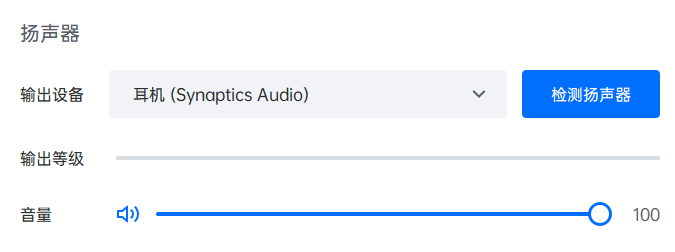
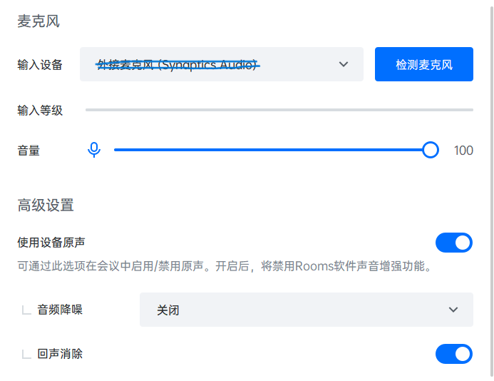
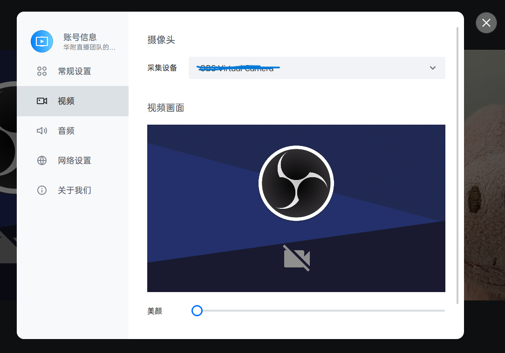
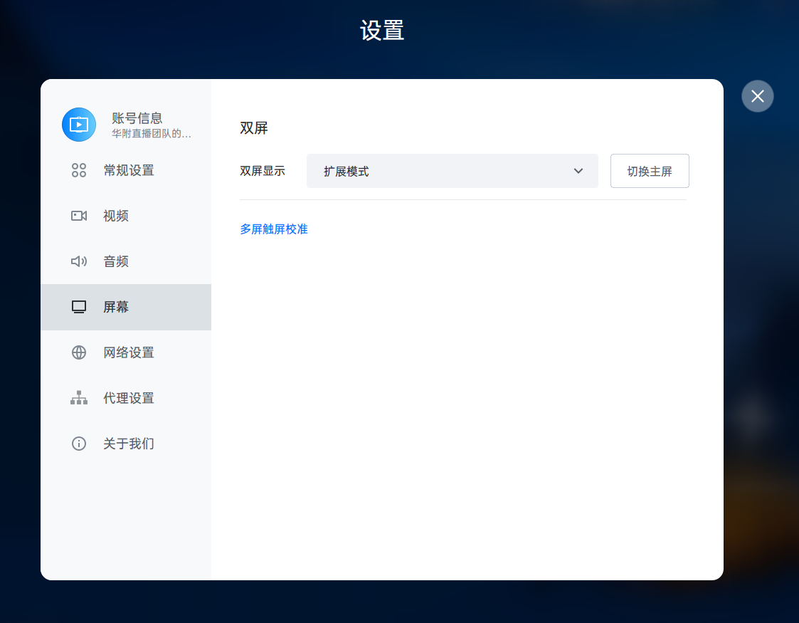
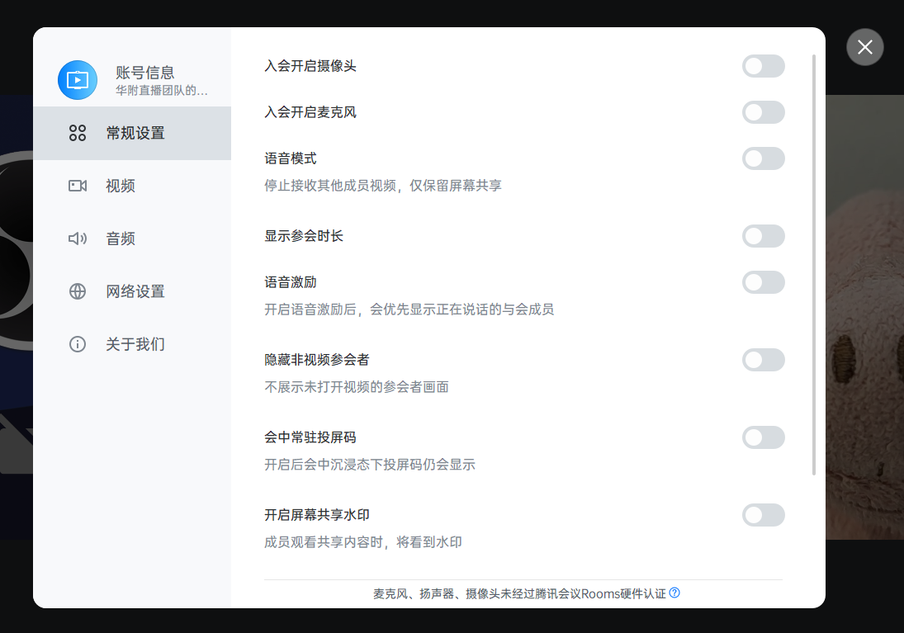

# HFLive13.0 技术指南

[TOC]

# 1. 拍摄组

## 1.1 SDI In 连线

## 1.2 小歌手机位布置

# 2. 线路组

## 2.1 Level A/B 问题

## 2.2 SDI In 连线

# 3. 技术组

## 3.1 直播间网络设备连接

## 3.2 采集卡声音采集

## 3.3 采集卡颜色问题

## 3.4 采集卡信号问题

## 3.5 校友连线

校友连线是华附春晚亮点节目之一，也是直播团队的中心工作之一。2021年我们采用了**腾讯会议Rooms+采集卡**方案。

### 3.5.1 连线

图 3.5.1-1 2021校友连线接线图

1. 用`3.5mm公-卡侬公线`连接电脑和音响组的现场调音台。

2. 用`6.5mm公-6.5mm公线`连接现场调音台输出和电子调音台输入，可以使用直播间预埋的线。

3. 用`双路卡侬公-卡侬母线`连接电子调音台输出和切换台输入。

4. 用`HDMI`连接切换台 Program输出 和矩阵输入。

5. 用`HDMI`连接矩阵输出和采集卡，用`USB`连接采集卡和电脑。

6. 用`HDMI`连接矩阵输出到现场大屏控制器。

   > 现场调音台、现场大屏的连接可以与凌燃燃老师沟通。

### 3.5.2 配置

#### 3.5.2.1 电脑配置

1. 将电脑输出画质更改为与切换台一致.
2. 将默认音频输入设备更改为采集卡输入（如`Capture Audio`）.
3. 将默认音频输出设备更改为耳机孔输出.

#### 3.5.2.2 腾讯会议Rooms配置

1. 将音频输出设为耳机孔输出（如 `耳机 (Synaptics Audio)`）.

   

   
图 3.5.2.2-1 输出设备设置

2. 音频输入设为**采集卡输入**（如`Capture Audio`)；在高级设置中，启用“使用设备原声”，开启“回声消除”，关闭“音频降噪”.

	

图 3.5.2.2-2 输入设备设置

3. 摄像头输入设为采集卡输入（如 `Capture Video`）.

	

图3.5.2.2-3 摄像头设置

4. 将双屏设置为“扩展模式”.

  

  
图3.5.2.2-4 屏幕设置

5. 为防止意外，关闭“入会开启摄像头”“入会开启麦克风”“语音激励”“隐藏非视频参会者”；为获得更纯净的画面，关闭“会中常驻投屏码”.

   

	
图3.5.2.2-5 常规设置

	
	> 软件可能会经常提示“麦克风、扬声器、摄像头未经过腾讯会议Rooms硬件认证”等，忽略即可。

#### 3.5.2.3  电子调音台配置

​	在电子调音台中，我们要确保现场调音台的输入能正确输出到 Main LR。

> 电子调音台相关配置可以请求音组协助，但还是建议技术组同学学习电子调音台基本操作方法。[产品官网](https://www.behringer.com/product.html?modelCode=P0BI8)

##### 3.5.2.4 矩阵设置

​	在矩阵中，将切换台Program输出正确映射到采集卡和现场大屏。

经过以上配置，参会者的声音能输出到现场的音响系统，参会者的画面能显示在切换台 Multiview 画面上，能输出到 Program；现场 Program 的画面和声音能够上传腾讯会议，参会者能听到现场的声音，能看到现场的画面。这也是校友连线的基本要求。

#### 3.5.3 现场工作

   校友连线非常考验现场的操作和应急情况处置能力。

   在主持人讲话时，提醒导播切到摄影机画面，在微信群通知下一个连线的地区。

   主持人与连线地区互动时，将该地区设为焦点画面，提醒导播将画面切到校友。

   出现突发故障时，第一时间使用对讲机通知主持人，立即确定故障位置并通知相关人员进行排障。

   >校友连线前，要进行大量的测试。必须至少一次按春晚流程进行1：1测试。同时，与校友连线负责人和主持人密切沟通，确认应急方案。

#### 3.5.4 提升

​	由上面的一系列配置不难发现，腾讯会议Rooms输出的校友声音最终又送回了腾讯会议Rooms输入里，我们依靠“回声消除”才能勉强不造成直播事故。因此 HFLive14.0+ 一定要不断尝试创新，在确保稳定性的前提下努力提高质量。以下建议供参考：

1. 优化接线方案

   

2. 尽量让校友多进行几次测试，特别是要让他们试一下像春晚那样大声喊的时候会不会炸麦。测试的时候要叫上音组的同学，也让他们演练一下到时候的音量控制。

3. 让校友尽量佩戴耳机，或者让他们的扬声器尽量远离麦克风，防止回荡。（比如另外用一台手机入会来听现场声音，电脑来录画面和声音）.

### 3.6 无人机信号连接

